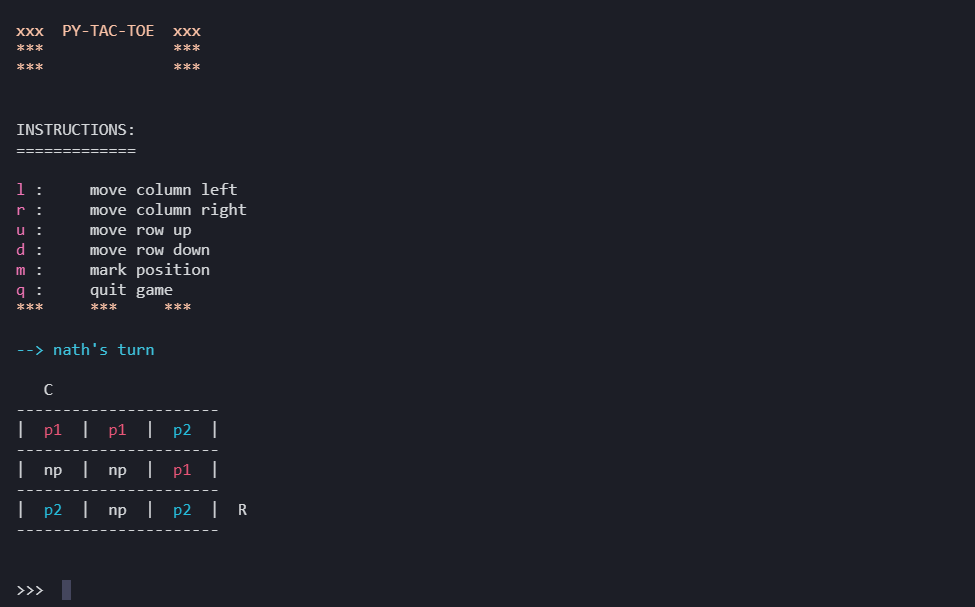

# py-tac-toe

Tic Tac Toe game written in python ( CLI ).

# Setup

- Clone this repository

- Create a virtual environment and activate it

- Install all dependencies in requirements.txt

- Run application using `python src/game_engine.py`

### How it is played

**py-tac-toe** is a two player game. During game play players can only make three moves.
Each player have a unique mark that gets inserted into the position they
choose to play on. When a player is out of moves, the player can remove a previous move ( player can remove the move that he made ) and replay with that move retrieved.

A player can navigate around the board using the navigation keys to position where to play on. Some of the navigation keys are

-- l ( moves column position to the left )

-- r ( moves column position to the right )

-- u ( moves row position up )

-- d ( moves row position down )

### Required functionalities    

-- Main menu that displays highest score with outlined navigations below

> -- Play   
> -- Create Player   
> -- Instructions    
> -- Exit

-- Persistence ( Pickleo r sqlite should do ) : let's keep track of scores and users
